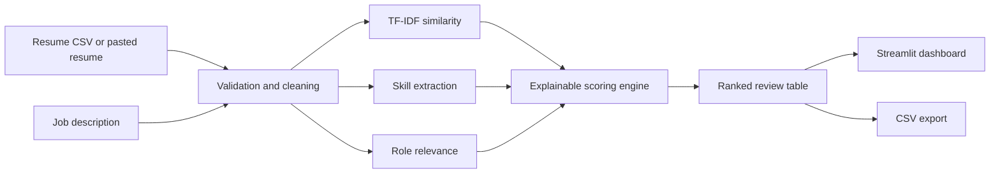

# SmartHire AI — Community Edition

<p align="center">
  <strong>Explainable, local-first resume screening and candidate ranking.</strong>
</p>

<p align="center">
  <a href="LICENSE"></a>
  
  
  
  <a href="https://github.com/itzPardhiv/FUTURE_ML_03/actions"></a>
</p>

SmartHire AI is an open-source Applicant Tracking System prototype that helps hiring teams compare resumes against a job description, extract skills, explain score components, and export a ranked review list.

> SmartHire AI is a **decision-support tool**, not an autonomous hiring system. Human review is required for every employment decision.

## Highlights

- Explainable ATS score with similarity, skill coverage, and role relevance
- TF-IDF cosine similarity using unigrams and bigrams
- Transparent regex-based skill extraction and skill-gap analysis
- Recruiter-friendly Streamlit dashboard
- CSV upload and ranked-result export
- Built-in anonymized sample data
- Robust CSV encoding fallbacks
- Automated tests and GitHub Actions CI
- No paid APIs and no cloud dependency

## Scoring Model

```text
ATS Score = 50% × Resume–JD Similarity
          + 30% × Required-Skill Coverage
          + 20% × Role Relevance
```

The score is intentionally transparent and configurable. It should be used to organize review, not to automatically accept or reject applicants.

## Architecture



## Repository Structure

```text
FUTURE_ML_03/
├── app/app.py                 # Streamlit application
├── src/
│   ├── category_model.py      # Optional LinearSVC category classifier
│   ├── data_loader.py         # Safe CSV loading and validation
│   ├── preprocessing.py       # Text normalization
│   ├── ranking.py             # End-to-end ranking workflow
│   ├── scoring.py             # Explainable ATS scoring
│   └── skill_extractor.py     # Skill detection and gap analysis
├── data/                      # Small anonymized sample datasets only
├── tests/                     # Automated tests
├── outputs/                   # Generated exports; ignored by Git
├── .github/workflows/ci.yml   # Continuous integration
├── main.py                    # Cross-platform launcher
└── requirements.txt
```

## Quick Start

```bash
git clone https://github.com/itzPardhiv/FUTURE_ML_03.git
cd FUTURE_ML_03
python -m venv .venv
```

### Activate the environment

Windows PowerShell:

```powershell
.\.venv\Scripts\Activate.ps1
```

Linux or macOS:

```bash
source .venv/bin/activate
```

### Install and run

```bash
python -m pip install --upgrade pip
pip install -r requirements.txt
python main.py
```

You may also launch it directly:

```bash
streamlit run app/app.py
```

## Using Your Own Data

Upload a CSV through the application. The app looks for common text-column names such as `Resume`, `resume`, `Resume_str`, `text`, `content`, and `description`. When none exists, it selects the first text-like column.

Recommended format:

```csv
Candidate,Category,Resume
Candidate 1,Data Scientist,"Python SQL pandas machine learning..."
Candidate 2,Frontend Developer,"React TypeScript CSS..."
```

Never commit real candidate resumes, personally identifiable information, secrets, trained-model binaries, generated outputs, or large datasets.

## Development

```bash
python -m compileall app src main.py
pytest -q
```

## Responsible Use and Limitations

- TF-IDF measures lexical similarity, not true candidate quality.
- Regex skill extraction may miss synonyms or context.
- Role relevance is a simple, inspectable heuristic.
- Resume datasets can encode historical bias.
- Scores must never be the sole basis for hiring decisions.
- Obtain permission before processing applicant data.

## Roadmap

- [ ] PDF and DOCX parsing
- [ ] Configurable recruiter scorecards
- [ ] Semantic embeddings with explainability
- [ ] Bias and fairness evaluation dashboard
- [ ] SQLite persistence and audit trail
- [ ] REST API
- [ ] Deployment guide

## Contributing

Contributions are welcome. Keep pull requests focused, add tests for new behavior, and never include real applicant data.

## Author

**A. J. Pardhiv**  
GitHub: [@itzPardhiv](https://github.com/itzPardhiv)  
LinkedIn: [AJ Pardhiv](https://www.linkedin.com/in/aj-pardhiv-406a40333)

## License

Released under the [MIT License](LICENSE).
